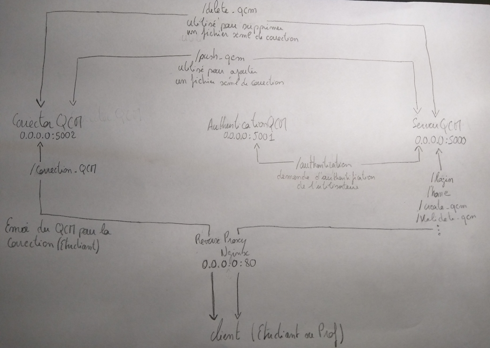

# Valerian-QCM-Dockerfile
Conception d'un application de solution de QCM pour le module RT0704

Valerian-QCM possède 3 services, écoutant sur 3 ports différents. Les 3 services sont Server-QCM, Authentication-QCM et Corrector-QCM qui écoute respectivement sur les ports 5000, 5001 et 5002.

## Run on docker

Il existe 3 version de Valerian-QCM dockeriser :

* valerian-dev
* valerian-prod
* valerian-nginx

#### valerian-dev

valerian-dev utilise le cgi fourni par flask, or d'après la documentation de flask, ce cgi doit uniquement être utilisé dans un environement de developpement/test.

**Exemple 1 :**

```bash
docker run -d -p 5000:5000 -p 5002:5002 -e GLOBAL_IP="192.168.168.143" clementgiaime/valerian-dev
```

La variable GLOBAL_IP doit être indiqué lors de la commande docker run, l'adresse IP doit correspondre à l'adresse IP qui héberge le conteneur.

Pour accéder à l'application il suffit de se connecté sur l'adresse : http://GLOBAL_IP:5000/

**Exemple 2 :**

```bash
docker run -d -p 80:5003 -p 8080:5004 -e GLOBAL_IP="192.168.168.143" \
   -e BIND_PORT_QCM="5003" \
   -e BIND_PORT_CORRECTOR="5004" \
   -e PORT_SERVER_QCM="80" \
   -e PORT_SERVER_CORRECTOR="8080" clementgiaime/valerian-dev
```
Dans ce cas l'adresse de connection est  http://GLOBAL_IP/
Correspondance :

| VARIABLE ENVIRONEMENT    | DESCRIPTION                                                                                                               |
| ------------------------ | ------------------------------------------------------------------------------------------------------------------------- |
| GLOBAL_IP                | doit être indiqué lors de la commande docker run, l'adresse IP doit correspondre à l'adresse IP qui héberge le conteneur. |
| BIND_PORT_QCM            | Correspond au port d'écoute du serveur QCM                                                                                |
| BIND_PORT_CORRECTOR      | Correspond au port d'écoute du Corrector QCM                                                                              |
| BIND_PORT_AUTHENTICATION | Correspond au port d'écoute du authentification QCM                                                                       |
| PORT_SERVER_QCM          | Correspond au port le hôte sur lequel BIND_PORT_QCM est mappé                                                             |
| PORT_SERVER_CORRECTOR    | Correspond au port le hôte sur lequel BIND_PORT_CORRECTOR est mappé                                                       |    

Bien sur les port mappés `-p 80:5003 -p 8080:5004` doivent correspondre avec les variables `PORT_SERVER_QCM` `BIND_PORT_QCM` `BIND_PORT_CORRECTOR` `BIND_PORT_AUTHENTICATION`
#### valerian-prod

Version de valerian déployé selon les best pratices, en utilisant Gunicorn. Gunicorn est un serveur web HTTP WSGI écrit en Python.

> While lightweight and easy to use, Flask’s built-in server is not suitable for production as it doesn’t scale well. Some of the options available for properly running Flask in production are documented here.

http://flask.pocoo.org/docs/1.0/deploying/

**Exemple 1 :**

```bash
docker run -d -p 5000:5000 -p 5002:5002 -e GLOBAL_IP="192.168.168.143" clementgiaime/valerian-dev
```

La variable GLOBAL_IP doit être indiqué lors de la commande docker run, l'adresse IP doit correspondre à l'adresse IP qui héberge le conteneur.

Pour accéder à l'application il suffit de se connecté sur l'adresse : http://GLOBAL_IP:5000/

**Exemple 2 :**

```bash
docker run -d -p 80:5003 -p 8080:5004 -e GLOBAL_IP="192.168.168.143" \
   -e BIND_PORT_QCM="5003" \
   -e BIND_PORT_CORRECTOR="5004" \
   -e PORT_SERVER_QCM="80" \
   -e PORT_SERVER_CORRECTOR="8080" clementgiaime/valerian-dev
```
Dans ce cas l'adresse de connection est  http://GLOBAL_IP/
Correspondance :

| VARIABLE ENVIRONEMENT    | DESCRIPTION                                                                                                               |
| ------------------------ | ------------------------------------------------------------------------------------------------------------------------- |
| GLOBAL_IP                | doit être indiqué lors de la commande docker run, l'adresse IP doit correspondre à l'adresse IP qui héberge le conteneur. |
| BIND_PORT_QCM            | Correspond au port d'écoute du serveur QCM                                                                                |
| BIND_PORT_CORRECTOR      | Correspond au port d'écoute du Corrector QCM                                                                              |
| BIND_PORT_AUTHENTICATION | Correspond au port d'écoute du authentification QCM                                                                       |
| PORT_SERVER_QCM          | Correspond au port le hôte sur lequel BIND_PORT_QCM est mappé                                                             |
| PORT_SERVER_CORRECTOR    | Correspond au port le hôte sur lequel BIND_PORT_CORRECTOR est mappé                                                       |    

Bien sur les port mappés `-p 80:5003 -p 8080:5004` doivent correspondre avec les variables `PORT_SERVER_QCM` `BIND_PORT_QCM` `BIND_PORT_CORRECTOR` `BIND_PORT_AUTHENTICATION`

#### valerian-nginx (The best)

Valerian-nginx est la version la plus abouti. En plus de respecter les bests practices, elle intègre un reverse proxy (merci le titre) qui ne requis aucune configuration de la part de l'utilisateur.

```bash
docker run -d -p 80:80 clementgiaime/valerian-nginx
```

## Architectures


